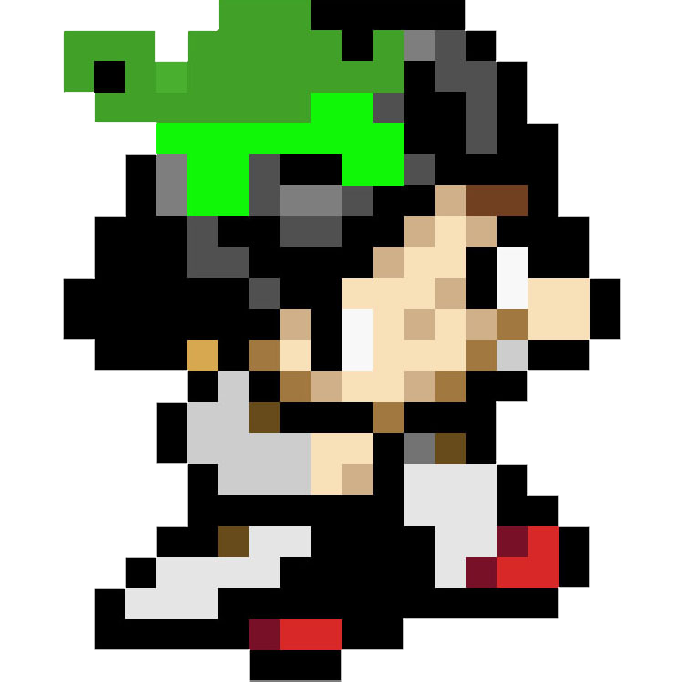

<p id="title" align="center">
  <a href="#title">
    
    <h1 align="center">Eddig - RPG Memory Game</h1>
  </a>
</p>

<p align="center">

  <a aria-label="Made By Edvaldo" href="https://github.com/edvaldinhs/">
    
  </a>
</p>

<p align="center">A RPG Memory Game for PPI</p>

<br>

## 🧪&nbsp; Technologies

This project was developed with the following technologies:

- [HTML](https://developer.mozilla.org/)
- [SASS](https://sass-lang.com/)
- [javascript](https://developer.mozilla.org/)
- [python](https://www.python.org)
- [django](https://www.djangoproject.com)
- [Postgres](https://neon.tech/)

Dev Dependencies:

- [Sass Compiler](https://marketplace.visualstudio.com/items?itemName=glenn2223.live-sass)
- [vercel](https://vercel.com/)

<br>

## 🎮&nbsp; Gaming

You can play and test the Ranking version of the game with the link below:

https://eddig.vercel.app/

on the other hand you can play the old version of the game with the link below:

https://eddig.netlify.app/

## 🧑🏻‍💻&nbsp; Getting Started

Clone the project and access the project folder

```bash
$ git clone https://github.com/edvaldinhs/eddig-django
$ cd eddig-django
```

Initiate a virtual environment

```bash
$ python -m venv .venv
$ source .venv/Scripts/activate
```

Install dependencies and run the project
```bash
$ cd eddig_slug
$ pip install -r requirements.txt
$ py manage.py runserver
```

<br>

## 💻&nbsp; Project

A project developed for the PPI discipline with the objective of improving the techniques of python, django, HTML, CSS and Javascript, feat [Marcelo Júnior](https://github.com/MimMarcelo)

<br>

## 🧑🏻&nbsp; Authors

<p align="center">
    
  <p align="center">
    Edvaldo Henrique
  </p >
</p>
